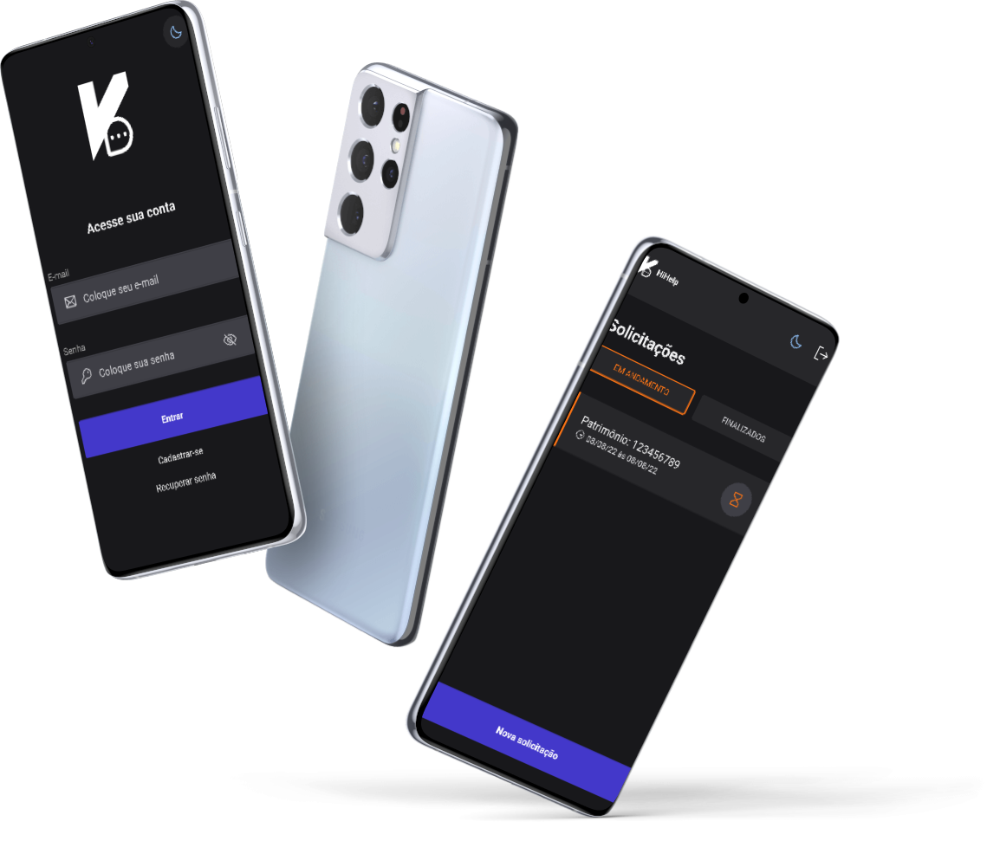
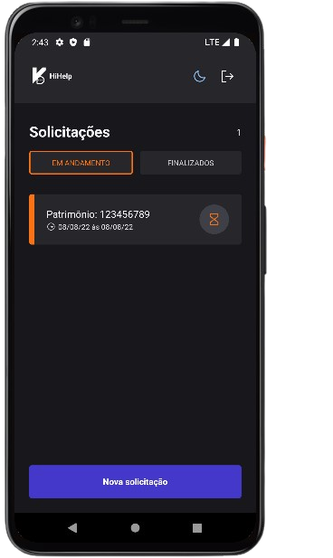

<p align="center">
	

  <h3 align="center">HiHelp</h3>
</p>

<p align="center">
  Application to register equipments failures on your company
</p>

---

<p align="center">
 <a href="#about">About</a> •
 <a href="#started">Getting started</a> •
 <a href="#built_using">Technologies</a> •
 <a href="#authors">Authors</a> •
 <a href="#acknowledgement">Acknowledgements</a>
</p>

---

## 🧐 About <a name = "about"></a>

This project was primarily done to study modern mobile technologies and create a real-world application using the [React Native](https://reactnative.dev/), [Expo](https://expo.dev/) and [Firebase](https://firebase.google.com/) technology stack. Not just the tech stack, I used libraries like [React navigation](https://reactnavigation.org/) for fast and reliable routing, [NativeBase](https://nativebase.io/) for UI components and [Zod](https://zod.dev/) for form validation.

It was only possible to create this application with quality because of the incredible event called Ignite Lab, an online bootcamp made by a great company called Rocketseat.
And this event was conducted by [Rodrigo Gonçalves](https://github.com/rodrigorgtic), a educator at Rocketseat.

<br/>

<p align="center">
  
</p>

## 🏁 Getting Started <a name = "started"></a>

These instructions will get you a copy of the project up and running on your local machine for development.

### 🎐 Prerequisites

- Node.js LTS release
- Git
- Watchman ( required only for macOS or Linux users )

### 💻 Setup firebase

1. Visit [Firebase](https://firebase.google.com/) and create a new account, If you already have an account, log in.

2. Create a new project in Firebase console.

3. Add a new application ( Android or iOS ) to the project.

4. Download `GoogleService-info.plist` file If you selected iOS platform, or `google-services.json` file If you selected Android platform, and copy to your project root.

### ✨ Installing the project

1. Install [Expo CLI](https://docs.expo.dev/workflow/expo-cli/) to serve the project in development, view logs, open the app on an emulator or a physical device, etc.

```
yarn add -g expo-cli
```

2. Install all dependencies

```
yarn install
```

3. Run the project locally on an emulator ( Its not possible to run on physical device because Expo + Firebase does not support Expo Go mobile application )

> On android
```
yarn android
```

> On iOS
```
yarn ios
```

4. See the project in the emulator

<p align="center">
  
</p>

## ⚙ Built with <a name = "built_using"></a>

### Technologies


### Tools


## ✍️ Authors <a name = "authors"></a>

- [@Hiyudev](https://github.com/Hiyudev)

## 🎉 Acknowledgements <a name = "acknowledgement"></a>

- <a href="https://github.com/diego3g">@diego3g</a> - CTO at <a href="https://github.com/Rocketseat">Rocketseat</a> ( Company responsible of this event )
- <a href="https://github.com/rodrigorgtic/">@rodrigorgtic</a> - Educator of this event ( Educator at Rocketseat )

## © License

- MIT License
